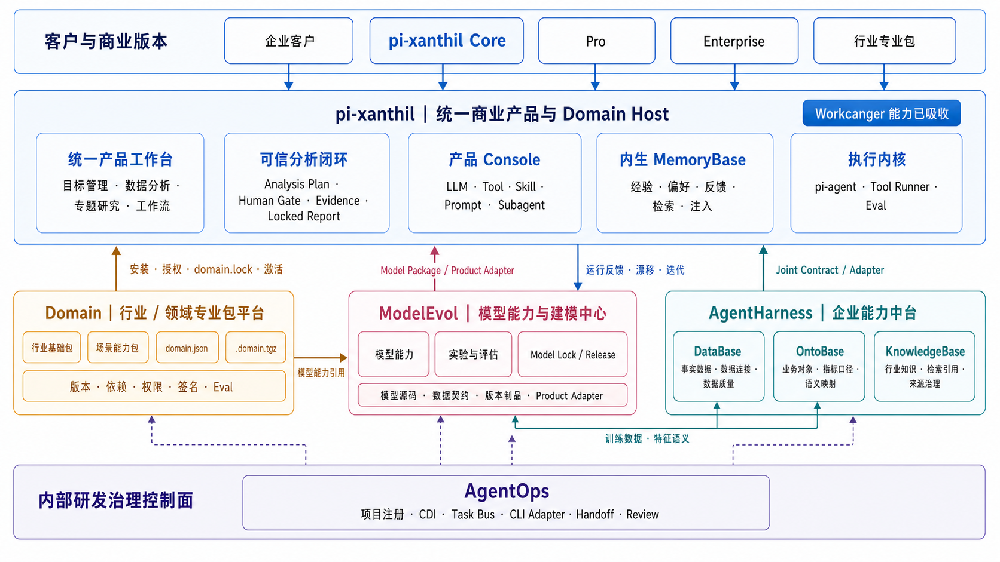

# pi-xanthil 商业化产品方案

日期：2026-07-18  
状态：讨论收敛版

## 1. 执行摘要

`pi-xanthil` 后续作为统一商业产品继续发展，并吸收 `Workcanger` 已形成的目标管理、数据分析、工作流、Human Gate、Evidence、Report Review 和 Locked Report 等产品能力。`Workcanger` 不再作为独立产品延续开发。

整体商业体系由五个相互独立但通过显式契约协作的项目构成：

- `pi-xanthil`：面向客户的统一商业产品，同时是 `Domain Host`。它提供产品工作台、可信分析闭环、产品 Console、内生 MemoryBase 和执行内核。
- `Domain`：行业与专业领域能力包平台。它负责把行业知识、方法、语义、工具、工作流、策略和验证能力封装为可版本化、可安装、可授权、可销售的 `Domain Package`。
- `AgentHarness`：企业能力中台。商业化重点收敛为 `DataBase`、`OntoBase` 和 `KnowledgeBase` 三类可选企业能力，通过 `Joint Contract` 被 `pi-xanthil` 消费。
- `ModelEvol`：模型能力与建模中心。它负责模型源码、数据契约、实验、评估证据、Model Lock、版本制品、发布和产品 adapter，不把模型生命周期耦合到单个产品仓库。
- `AgentOps`：内部研发治理控制面。它负责项目注册、CDI、Task Bus、多 CLI adapter、handoff、review 和开发 agent 专业记忆，不作为客户业务产品销售。

核心商业结构是：

```text
pi-xanthil Core
  + Industry / Professional Domain Packs
  + Pro
  + Enterprise
  + AgentHarness Enterprise Add-ons
  + ModelEvol Modeling Add-ons
```

客户购买的不是若干技术目录，而是一套能够安全完成数据分析、加载行业专业能力、形成可信报告并持续积累组织经验的产品。



## 2. 产品定位

### 2.1 pi-xanthil

`pi-xanthil` 定位为本地安全、可扩展、可治理的 AI 数据分析 Agent OS，也是整个商业体系唯一的主产品入口。

它面向两类用户：

- 业务用户：通过目标管理、数据分析、专题研究和工作流完成可信分析。
- 专业分析师及企业管理员：配置数据、模型、Tool、Skill、Workflow、领域包和治理策略。

`pi-xanthil` 必须保持完整的基础分析闭环，不能把 Core 做成只能演示、无法完成真实工作的阉割版本。

### 2.2 Domain

`Domain` 定位为行业和专业能力的商品生产、验证与发布平台，不直接承担客户运行状态。

它负责：

- `domain.json` 中立 manifest。
- Package、Capability 和 Publisher 的稳定身份。
- 语义化版本、依赖、扩展、替代和冲突。
- Knowledge、Ontology、Skill、Workflow、Command、Agent Role、Tool、Policy、Eval 和报告模板等专业资产。
- 权限声明、checksum、签名、信任状态和不可变 `.domain.tgz`。
- 合同验证、安全验证和领域质量 Eval。

`Domain Package` 不直接绑定 `pi-xanthil` 内部源码、AgentHarness 表结构或 pi CLI 参数。

### 2.3 AgentHarness

`AgentHarness` 定位为可选的企业数据、语义和知识能力中台。它不接管 `pi-xanthil` 的产品工作台，也不重复 AgentOps 的开发治理能力。

商业化重点包括：

- `DataBase`：事实数据、数据连接、标准数据模型、字段映射、数据质量和血缘。
- `OntoBase`：业务对象、关系、指标口径、语义映射、解释规则和 source binding。
- `KnowledgeBase`：企业文档、行业资料、切片索引、检索引用、版本和来源治理。

三者通过显式 `Joint Contract` 向 `pi-xanthil` 提供能力，不要求客户理解内部存储实现。

### 2.4 ModelEvol

`ModelEvol` 定位为独立于产品实现的模型能力与源码中心，负责建模能力从数据契约确认到产品发布和反馈迭代的完整治理。

它负责：

- 模型能力目标、范围、输入输出和数据契约。
- 训练、校准、特征工程、实验记录和评估证据。
- Model Lock、版本制品、Release、回滚和限制条件。
- 面向 `pi-xanthil` 的 Product Adapter、字段映射和分发路径。
- 产品运行反馈、漂移、误预测和下一轮迭代触发。

`ModelEvol` 拥有模型源码和模型版本真源；`pi-xanthil` 拥有产品运行、UI、调用、部署和用户反馈入口。`DataBase` 可提供训练及评估事实数据，`OntoBase` 可提供特征和指标语义，二者都通过明确 contract 被 ModelEvol 消费。

### 2.5 AgentOps

`AgentOps` 定位为内部研发生产线和治理控制面。

它负责：

- 注册和管理研发项目。
- CDI Controller/Domain Agent 协作。
- Task Bus、依赖、handoff 和 review。
- Command、Skill、Workflow 的中立源与多 CLI adapter。
- 开发 agent 的专业记忆和经验治理。
- 跨项目实施 prompt 与 contract gate。

AgentOps 不保存客户业务真相，不成为客户运行时，也不作为 `pi-xanthil` 的业务 Console。

## 3. pi-xanthil 产品架构

### 3.1 产品体验层

`pi-xanthil` 对客户提供统一工作台：

- 目标管理：把业务目标和目标差距转化为可执行分析任务。
- 数据分析：从业务问题、材料和数据出发完成一次可信分析。
- 专题研究：围绕复杂问题组织假设、证据和多阶段验证。
- 工作流：把高频分析固化为可复跑、可参数化、可审核的流程。

原 `Workcanger` 的能力并入这一层，不再形成第二套产品入口。

### 3.2 可信分析闭环

所有核心分析路径共享以下闭环：

```text
业务问题与材料
  -> Structured Requirement
  -> Analysis Plan
  -> Human Gate
  -> Analysis Run
  -> Internal Review
  -> Evidence
  -> Report Review
  -> Locked Report
  -> 反馈与经验沉淀
```

产品必须确保：

- 用户不能绕过关键 Human Gate。
- 事实、推断、限制条件和误读风险明确区分。
- 报告可以追溯到数据、证据、模型、Tool、Skill 和 Domain Package 版本。
- schema 或 Tool 错误不能交给 LLM 猜测修复。
- 原始敏感数据遵循本地安全和最小暴露原则。

### 3.3 产品 Console

产品 Console 与 `pi-xanthil` 保持集成，负责：

- LLM 和模型配置。
- Tool、Skill、Prompt、Command、Hook 和 Subagent 管理。
- Workflow、Domain Package 和权限配置。
- 运行观察、Trace、评测和健康检查。
- 产品内 MemoryBase 的查看、反馈和治理入口。

产品 Console 不拆成客户必须单独部署和切换的另一套产品。

### 3.4 内生 MemoryBase

MemoryBase 作为 `pi-xanthil` 的内生智能能力，贯穿运行过程：

```text
运行轨迹
  -> 经验候选
  -> 蒸馏与风险门禁
  -> 自动晋升或人工复核
  -> 多信号检索
  -> prompt 注入
  -> helpful / wrong 反馈
  -> 老化、冲突和 supersede
```

MemoryBase 不作为独立附加产品拆售，但可以通过版本分层收费：

- Core：个人和本地工作区基础记忆。
- Pro：自动蒸馏、高级检索、评估、老化和跨项目复用。
- Enterprise：团队共享、审批、权限、审计和私有化治理。

行业包提供的固定规则、方法和失败模式优先归类为 Knowledge、Policy、Skill 或 Eval；只有客户真实运行后形成的经验才进入客户 MemoryBase。

## 4. Domain Package 商品体系

### 4.1 两级包结构

Domain Package 采用“行业基础包 + 场景能力包”的组合结构。

行业基础包提供：

- 行业 Ontology。
- 行业对象、关系和术语。
- 指标字典和指标口径。
- 数据要求、字段语义和映射规则。
- 行业知识、方法论和标准。
- 通用 Policy 和基础 Eval。

场景能力包提供：

- 面向具体业务问题的 Command。
- 专业 Skill、Agent Role 和 Workflow。
- 确定性 Tool。
- 分析 Gate 和停止条件。
- 报告结构和模板。
- 领域质量 Eval 和安全 Eval。

### 4.2 建议商品

第一阶段可形成以下 SKU：

- `Retail Foundation Pack`：零售行业基础语义、指标、数据要求和知识。
- `Audience Profile Insights Pack`：人群画像与洞察。
- `Member Retention Pack`：会员复购和流失诊断。
- `Sales Decline Diagnosis Pack`：销售下滑贡献拆解与诊断。
- `Campaign Review Pack`：营销活动复盘。
- `Store Performance Pack`：门店经营分析。

客户购买的是“解决某类业务问题的完整专业能力”，而不是孤立的 prompt、文档或数据库表。

### 4.3 安装和激活

`pi-xanthil` 作为正式 `Domain Host`，负责：

```text
购买 / 获取 License
  -> 下载不可变 .domain.tgz
  -> 校验 manifest / checksum / signature / Eval
  -> 安装到本机 Domain Store
  -> 工作区显式启用
  -> 生成 domain.lock
  -> Analysis Plan 确认 Capability 与权限
  -> 生成 Execution Profile
  -> 执行
```

安装不等于启用，启用不等于自动获得 Tool 权限。历史 Run 永远引用启动时的包版本、checksum、权限和 Execution Profile。

## 5. AgentHarness 企业附加能力

### 5.1 DataBase 商业能力

对外不以“再卖一个数据库”为主要心智，而包装为：

- 企业数据连接器。
- 行业标准数据模型。
- 数据字段映射和入库规则。
- 数据质量检查和数据血缘。
- 平台标签、公共参考数据和行业 benchmark。
- 私有数据接入与治理服务。

### 5.2 OntoBase 商业能力

OntoBase 是高价值企业附加能力，适合提供：

- 行业 Ontology。
- 企业定制业务对象和关系。
- 指标口径与语义层。
- 平台标签和企业字段到业务语义的映射。
- 解释规则、决策规则和 source binding。
- Ontology 版本、审核和发布治理。

### 5.3 KnowledgeBase 商业能力

KnowledgeBase 适合提供：

- 企业私有知识空间。
- 文档接入、解析、切片和索引。
- 检索、引用和来源追溯。
- 行业知识订阅和持续更新。
- 权限、版本、过期和内容治理。
- 与 OntoBase 对象和指标的语义绑定。

基础的本地文档上传和检索可以进入 Core；企业知识治理、行业内容和持续更新作为付费能力。

## 6. ModelEvol 建模能力

ModelEvol 形成独立的模型能力生产与治理链：

```text
Capability Intake
  -> Data Contract
  -> Experiment Plan
  -> Training / Calibration
  -> Evaluation Review
  -> Model Lock
  -> Model Package / Product Adapter
  -> pi-xanthil Runtime Validation
  -> Feedback / Drift / Next Iteration
```

对外商业化时，不把 ModelEvol 简化为一个训练脚本，而包装为：

- 预训练或已校准的行业模型能力包。
- 企业自有数据建模与校准服务。
- 模型评估、版本锁定、发布、回滚和审计。
- 产品渠道匹配、人群评分、预测、推荐和其他场景模型。
- 模型持续迭代、漂移检测和效果评估服务。

基础已发布模型可以随 Domain 场景包交付；自定义建模、模型治理和持续迭代作为 Pro/Enterprise 或独立 Modeling Add-on 收费。

## 7. 产品版本与收费结构

| 版本 | 目标客户 | 主要能力 | 收费逻辑 |
| --- | --- | --- | --- |
| Core | 个人用户、小团队、试用客户 | 完整本地分析闭环、基础 Console、基础 Memory、基础数据和文档接入 | 免费或低价入口 |
| Industry Packs | 有明确行业和场景需求的客户 | 行业基础包、场景包、专业 Tool、Workflow、Policy、Eval 和模板 | 按包订阅或永久 License + 更新服务 |
| Pro | 专业分析团队 | 高级记忆、批量任务、版本管理、高级评测、团队工作流 | 按用户或团队订阅 |
| Enterprise | 中大型企业 | 私有化、SSO/RBAC、审批审计、团队共享、定制能力和支持 | 年费、项目费和服务费 |
| AgentHarness Add-ons | 需要数据、语义和知识中台的企业 | DataBase、OntoBase、KnowledgeBase 企业能力 | 按模块、数据源、环境或组织授权 |
| ModelEvol Add-ons | 需要专属模型和持续迭代的企业 | 自定义建模、评估、Model Lock、发布、漂移和效果治理 | 按模型能力、实验周期或年度服务授权 |

## 8. 端到端运行关系

```text
Domain 构建专业包
  -> validate / eval / pack / sign
  -> 发布不可变 Domain Package
  -> 客户通过 pi-xanthil 购买和安装
  -> pi-xanthil 生成 domain.lock
  -> AgentHarness Adapter 检查数据、语义和知识能力
  -> 用户确认 Analysis Plan
  -> 生成 Execution Profile
  -> ModelEvol 提供已锁定 Model Package / Product Adapter
  -> pi-agent 执行 Skill / Workflow / Tool / Model
  -> pi-xanthil 保存 Run / Evidence / Review / Locked Report
  -> 用户反馈进入内生 MemoryBase
  -> 模型效果、漂移和误预测反馈回 ModelEvol
  -> 后续任务复用客户经验
```

权威边界如下：

- Domain：专业包源资产、版本、依赖、权限声明和质量 Eval 的权威来源。
- AgentHarness：企业事实数据、业务语义和知识索引的权威来源。
- ModelEvol：模型源码、实验、评估证据、Model Lock、发布制品和产品 adapter 的权威来源。
- pi-xanthil：客户工作区、安装启用、运行、Evidence、Report、产品记忆和用户体验的权威来源。
- AgentOps：研发协作规则和交付过程的权威来源。

## 9. 分阶段商业化路线

### 阶段一：统一产品

- 停止把 Workcanger 作为独立产品继续建设。
- 将其 Requirement、Plan、Human Gate、Evidence 和 Locked Report 能力吸收到 `pi-xanthil`。
- 保留 `pi-xanthil` 现有专业分析、Tool、Skill、Workflow、Memory 和 Console 能力。
- 明确唯一产品身份和统一用户工作区。

### 阶段二：Domain Host

- 冻结 Domain Package v1 contract。
- 在 `pi-xanthil` 建立安装、校验、启用、`domain.lock` 和 Execution Profile。
- 完成 `Audience Profile Insights Pack` 首个真实行业包。
- 建立购买、License 和版本升级的最小闭环。

### 阶段三：AgentHarness 企业能力

- 建立 `pi-xanthil` 与 AgentHarness 的消费契约。
- 优先打通 DataBase、OntoBase 和 KnowledgeBase 的只读能力。
- 用 Domain Package 中立资产映射到 AgentHarness，而不是让包依赖内部表结构。
- 完成来源、版本、权限和跨库身份追溯。

### 阶段四：ModelEvol 建模能力

- 建立 `pi-xanthil` 与 ModelEvol 的 Product Integration Contract。
- 打通 Model Package / Product Adapter、运行时版本标记和回滚验证。
- 让 DataBase 训练事实和 OntoBase 特征语义通过 contract 进入建模流程。
- 建立产品反馈、模型效果、漂移和下一轮实验的闭环。

### 阶段五：规模化销售

- 建立行业基础包和场景包产品线。
- 推出 Pro 和 Enterprise 版本。
- 提供私有化、企业数据适配、定制 Ontology、企业知识治理和专业服务。
- 根据实际客户需求再决定是否建设公共 Domain registry 或 marketplace。

## 10. 最终产品心智

```text
pi-xanthil
  = 客户购买和使用的统一 AI 数据分析产品

Domain
  = 可以持续生产和销售的行业专家能力

AgentHarness
  = 企业可选的数据、语义和知识中台

ModelEvol
  = 企业可选的模型能力、建模、评估与持续迭代中心

AgentOps
  = 支撑整个产品体系持续开发和交付的内部控制面
```

商业化的核心不是拆出更多孤立产品，而是形成一个统一产品入口、一个可持续扩张的专业包商品体系，以及数据、语义、知识和模型四类面向企业客户的附加能力。
